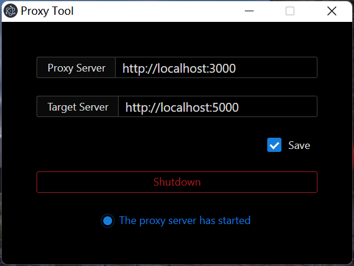

<h1 align="center">Front Proxy</h1>
<p align="center"></p>

## 背景

最近在公司前端项目中发现，每当拉取主分支代码时（只能pull,不能push），我本地 WDS(webpack-dev-server)  配置总是被修改，甚至会造成冲突。

原因：假设前端项目n个人去开发，每个人本地的 WDS 对应着n + n个不同的后端服务, 等到团队发布新版本，Leader强制合并这部分代码(不影响生产环境)，让我们再拉取主分支时，WDS 又被覆盖了。

这时候我的心情时这样的

<p align="center"></p>

## 寻找方案

##### 为什么不是 Nginx?

nginx 可以说是最佳方案，只不过每次切换代理服务器需要手动编辑nginx.conf，又去手动重启服务。麻（懒）烦（惰）！
<br>

##### 为什么不是 SwitchHosts?

SwitchHosts 也是非常方便的工具，可以解决上述的痛点。但缺点也很明显，直接改你系统Hosts文件，实现代理。如果我不愿意接受一个工具随便改我Hosts呢？它要改就改？这是我个人比较反感的一点。
<br>

##### 为什么不是其它更优秀的工具?

懒得找！哪怕找到了，也不一定适合我的要求。

## 下载

  |     平台    |                                              下载地址                                                        |
  |:-----------:|:-----------------------------------------------------------------------------------------------------------:|
  |Window x32   |尽情期待                                                                                                      |
  |Window x64   |[Window x64](https://balqish-oss-service.oss-cn-shenzhen.aliyuncs.com/proxy-tool/Proxy%20Tool_x64_v1.0.0.exe)|
  |MAC          |尽情期待                                                                                                      |
  |Linux x32    |尽情期待                                                                                                      |
  |Linux x64    |尽情期待                                                                                                      |

## 使用方法

假设：前端项目 webpack-dev-server 配置是这样的

```js
module.exports = {
  devServer: {
    port: 3000,
    proxy: {
      '/foo': {
        target: 'http://www.foo.com'
      }
    }
  }
}
```

我们每次被冲突的部分是 proxy 配置项，所以把它改造成：

```js
// Front Proxy 代理服务器地址
const proxyServer = 'http://localhost:5000'

module.exports = {
  devServer: {
    port: 3000,
    proxy: {
      '/foo': {
        target: proxyServer
      }
    }
  }
}

```

这时候 webpack-dev-server 就不存在代码冲突问题了，因为每个人的配置是一样的。
<br>
接下来打开工具，填入服务器地址，并启动即可。

  |        Proxy Server   |     Target Server  |
  |:---------------------:|:------------------:|
  |<http://localhost:5000>|<http://www.foo.com>|

###### tips: 目前 Front Proxy 只支持单个服务器的代理, 后期迭代会支持多个目标服务器，多个匹配规则

## 技术实现

  - electron + react
  - 原生 ES Module 编写
  - 不使用 Webpack, Babel 等编译工具
